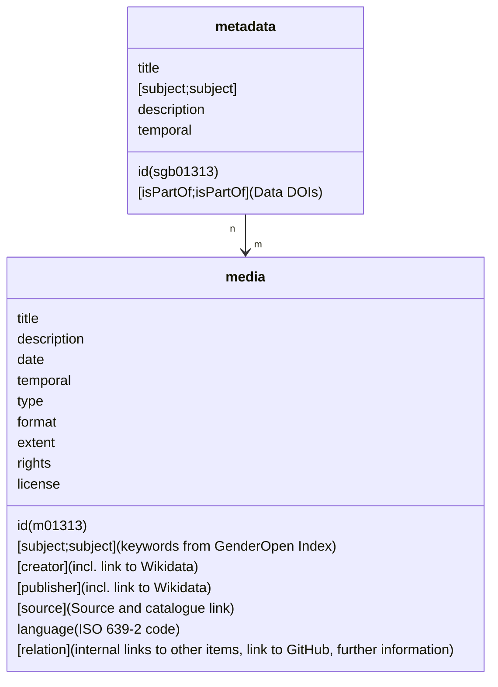

# forschung.stadtgeschichtebasel.ch

The open-source code of the digital platform for research data of Stadt.Geschichte.Basel.

[](https://github.com/Stadt-Geschichte-Basel/forschung.stadtgeschichtebasel.ch/issues)
[](https://github.com/Stadt-Geschichte-Basel/forschung.stadtgeschichtebasel.ch/network)
[](https://github.com/Stadt-Geschichte-Basel/forschung.stadtgeschichtebasel.ch/stargazers)
[](https://github.com/Stadt-Geschichte-Basel/forschung.stadtgeschichtebasel.ch/blob/main/LICENSE)

## Overview

Welcome to [Stadt.Geschichte.Basel](https://stadtgeschichtebasel.ch/), a historical research project at the University of Basel in Switzerland, funded with over 9 million Swiss Francs from public and private sources, running from 2017 to 2025. It is a comprehensive digital and print project that aims to present the multifaceted history of Basel from its earliest beginnings to the present day. Visit [Stadt.Geschichte.Basel](https://stadtgeschichtebasel.ch) to see how our digital portal brings Basel's history to life.

Stadt.Geschichte.Basel seeks to bridge research gaps and present historical findings in accessible formats. Our project encompasses an [extensive nine-volume book series](https://www.merianverlag.ch/buecher/stadt.geschichte.basel.html), an overview volume, a digital portal, and a digital platform for research data. Hosted at the University of Basel, this project aims to make historical research and insights accessible to scholars and the public like never before.

This project is the open-source code of the digital platform for research data of Stadt.Geschichte.Basel. It is a static website built with [CollectionBuilder-CSV](https://collectionbuilder.github.io/) and hosted on [GitHub Pages](https://pages.github.com/). The research data collection itself is hosted at the University of Bern's [instance of Omeka S](https://omeka.unibe.ch/s/stadtgeschichtebasel/page/sgb).

## Key Features

- **Fast Static Website**: Built with CollectionBuilder-CSV using open source static site generator [Jekyll](https://jekyllrb.com/) and a modern static web stack.
- **Explorative Access to Metadata**: Interactive features for exploring collection metadata such as a timeline, filtering and comprehensive annotation.
- **Sensitive Content Annotation**: Collection items are annotated using the [GenderOpen Index](https://opengenderplatform.de/schlagwortindex), a controlled vocabulary for sensitive content.
- **Accessibility-Focused Design**: Ensuring inclusivity for all users by complying with WCAG standards and observing neurodiversity design guidelines. More at our [accessibility statement](https://stadtgeschichtebasel.ch/barrierefreiheitserklaerung/).

### CollectionBuilder 

The technical basis for Stadt.Geschichte.Basel's research data platform is provided by [CollectionBuilder](https://collectionbuilder.github.io/), an open source framework for creating metadata-driven digital collections. CollectionBuilder is a project maintained by the University of Idaho Library's [Digital Initiatives](https://www.lib.uidaho.edu/digital/) and the [Center for Digital Inquiry and Learning](https://cdil.lib.uidaho.edu) (CDIL) following the [Lib-Static](https://lib-static.github.io/) methodology. 

The basic theme is created using [Bootstrap](https://getbootstrap.com/).
Metadata visualizations are built using open source libraries such as [DataTables](https://datatables.net/), [Spotlight gallery](https://github.com/nextapps-de/spotlight), [lazysizes](https://github.com/aFarkas/lazysizes), and [Lunr.js](https://lunrjs.com/).
Object metadata is exposed using [Schema.org](http://schema.org) and [Open Graph protocol](http://ogp.me/) standards.

For more information on CollectionBuilder, visit the [Docs](https://collectionbuilder.github.io/cb-docs/).

## Data Model

Metadata for items featured on the research data platform is provided according to a data model developed by the Stadt.Geschichte.Basel Research Data Management Team to meet the requirements of the wide range of sources used in the project. The data model (and the subsequent annotation process) follow the [Manual for Creating Non-Discriminatory Metadata for Historical Sources and Research Data](https://maehr.github.io/diskriminierungsfreie-metadaten/) developed by Stadt.Geschichte.Basel.

The following chart illustrates the data model with metadata fields for a sample metadata object `sgb01313` that has one child media object `m01313`. If a metadata object has more than one child media object, the children `id`s are numbered consecutively: `m01313_1`, `m01313_2` etc.



## Installation

Use [Bundle](https://bundler.io/) to install all dependencies.

```bash
bundle install
```

## Usage

Run the development server.

```bash
bundle exec jekyll serve
```

Build for production.

```bash
rake deploy
```

## Support

This project is maintained by [@Stadt-Geschichte-Basel](https://github.com/Stadt-Geschichte-Basel). Please understand that we won't be able to provide individual support via email. We believe that help is much more valuable if it's shared publicly, so that more people can benefit from it.

| Type                                   | Platforms                                                                                           |
| -------------------------------------- | --------------------------------------------------------------------------------------------------- |
| 🚨 **Bug Reports**                     | [GitHub Issue Tracker](https://github.com/Stadt-Geschichte-Basel/forschung.stadtgeschichtebasel.ch/issues)    |
| 🎁 **Feature Requests**                | [GitHub Issue Tracker](https://github.com/Stadt-Geschichte-Basel/forschung.stadtgeschichtebasel.ch/issues)    |
| 🛡 **Report a security vulnerability** | [GitHub Issue Tracker](https://github.com/Stadt-Geschichte-Basel/forschung.stadtgeschichtebasel.ch/issues)    |
| 💬 **General Questions**               | [GitHub Discussions](https://github.com/Stadt-Geschichte-Basel/forschung.stadtgeschichtebasel.ch/discussions) |

## Contributing

Please read [CONTRIBUTING.md](CONTRIBUTING.md) for details on our code of conduct, and the process for submitting pull requests to us.

## Versioning

We use [SemVer](http://semver.org/) for versioning. For the versions available, see the [tags on this repository](https://github.com/Stadt-Geschichte-Basel/forschung.stadtgeschichtebasel.ch/tags).

## Authors and acknowledgment

- **Moritz Mähr** - [maehr](https://github.com/maehr)
- **Nico Görlich** - [koilebeit](https://github.com/koilebeit)
- **Moritz Twente** - [mtwente](https://github.com/mtwente)

See also the list of [contributors](https://github.com/Stadt-Geschichte-Basel/forschung.stadtgeschichtebasel.ch/graphs/contributors) who participated in this project.

----------

## License

The code in this repository is licensed under the [MIT](https://github.com/Stadt-Geschichte-Basel/forschung.stadtgeschichtebasel.ch/blob/main/LICENSE) license. This license does not include external dependencies included in the `assets/lib` directory, which are covered by their individual licenses.

Any content relating to the items that form the research data collection (e.g. media files, metadata objects) at [forschung.stadtgeschichtebasel.ch](https://forschung.stadtgeschichtebasel.ch) are *NOT* covered by this license. Please see the individual rights and license statement in the corresponding metadata for each collection item.
