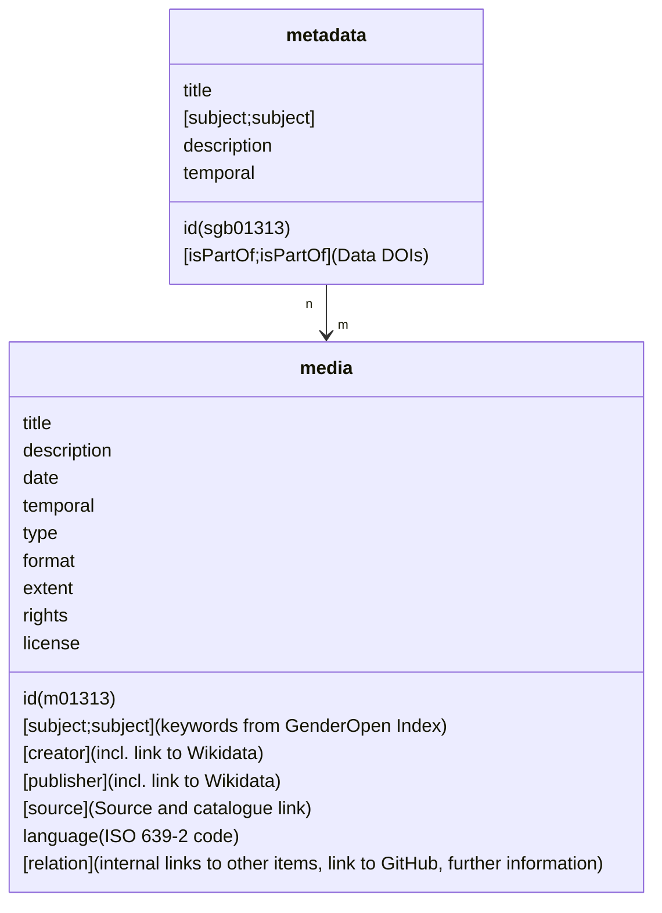

# forschung.stadtgeschichtebasel.ch

Open-source code of the **digital research data platform** for [Stadt.Geschichte.Basel](https://stadtgeschichtebasel.ch) — a major historical research initiative hosted at the University of Basel.

[](https://github.com/Stadt-Geschichte-Basel/forschung.stadtgeschichtebasel.ch/issues)
[](https://github.com/Stadt-Geschichte-Basel/forschung.stadtgeschichtebasel.ch/network)
[](https://github.com/Stadt-Geschichte-Basel/forschung.stadtgeschichtebasel.ch/stargazers)
[](https://github.com/Stadt-Geschichte-Basel/forschung.stadtgeschichtebasel.ch/blob/main/LICENSE)

## 🔎 Overview

Welcome to [Stadt.Geschichte.Basel](https://stadtgeschichtebasel.ch/), a historical research project at the University of Basel in Switzerland, funded with over 9 million Swiss Francs from public and private sources, running from 2017 to 2025. It is a comprehensive digital and print project that aims to present the multifaceted history of Basel from its earliest beginnings to the present day. Visit [Stadt.Geschichte.Basel](https://stadtgeschichtebasel.ch) to see how our digital portal brings Basel's history to life.

Stadt.Geschichte.Basel seeks to bridge research gaps and present historical findings in accessible formats. Our project encompasses an [extensive nine-volume book series](https://www.merianverlag.ch/buecher/stadt.geschichte.basel.html), an overview volume, a digital portal, and a digital platform for research data. Hosted at the University of Basel, this project aims to make historical research and insights accessible to scholars and the public like never before.

This repository contains the **source code for the research data platform**, built with [CollectionBuilder-CSV](https://collectionbuilder.github.io/), a static site generator based on [Jekyll](https://jekyllrb.com/) and deployed via [GitHub Pages](https://pages.github.com/).  
The collection data is maintained on the [University of Bern’s Omeka S instance](https://omeka.unibe.ch/s/stadtgeschichtebasel/page/sgb).

## ⚙️ Features

- **Static Site Generator**: Fast, scalable, minimal-maintenance architecture using Jekyll.
- **Interactive Metadata Exploration**: Timelines, filters, annotations, and visualizations.
- **Inclusive Metadata Practices**: Based on our [Manual for Creating Non-Discriminatory Metadata](https://maehr.github.io/diskriminierungsfreie-metadaten/).
- **Accessibility-First Design**: Compliant with [WCAG](https://www.w3.org/WAI/standards-guidelines/wcag/), designed with [Neurodiversity Design System](https://neurodiversity.design/) guidelines in mind.
- **Open Standards**: Schema.org, Open Graph, EDTF support, and reusable modular components.

### 🔧 Project-Specific Extensions to CollectionBuilder

The technical basis for Stadt.Geschichte.Basel's research data platform is provided by [CollectionBuilder](https://collectionbuilder.github.io/), an open source framework for creating metadata-driven digital collections. CollectionBuilder is a project maintained by the University of Idaho Library's [Digital Initiatives](https://www.lib.uidaho.edu/digital/) and the [Center for Digital Inquiry and Learning](https://cdil.lib.uidaho.edu) (CDIL) following the [Lib-Static](https://lib-static.github.io/) methodology.

The basic theme is created using [Bootstrap](https://getbootstrap.com/).
Metadata visualizations are built using open source libraries such as [DataTables](https://datatables.net/), [Spotlight gallery](https://github.com/nextapps-de/spotlight), [lazysizes](https://github.com/aFarkas/lazysizes), [Lunr.js](https://lunrjs.com/) and [Leaflet](https://leafletjs.com/).
Object metadata is exposed using [Schema.org](http://schema.org) and [Open Graph protocol](http://ogp.me/) standards.

For more information on CollectionBuilder, visit the [Docs](https://collectionbuilder.github.io/cb-docs/).

Stadt.Geschichte.Basel has extended CollectionBuilder with some features that are not (yet) included in the CollectionBuilder project. These are the following extensions:

- **List Visualization**: In addition to wordclouds, fields can be visualized in a list including their frequencies.
- **EDTF Timeline Page**: Based on the existing solution, an enhanced timeline was created that supports year numbers in Extended Date/Time Format ([EDTF](https://www.loc.gov/standards/datetime/)).
- **Item Layout "Geodata"**: Definition of a new display_template ("geodata"). An interactive map was created as a new item view to display `geojson` files.
- **Item Layout "Table"**: Tabular data is read from `csv` files and displayed as an interactive table with search and filter features directly on the item page.
- **Multi-Language Support for Theming**: So far, German and Spanish are supported. English is the default language.
- **Trigger Warning**: To draw attention to possibly sensitive contents of the collection, a trigger warning has been added, which appears once when the page is visited.
- **Report Button**: A button has been added to the item view that allows the user to report incorrect data.
- **Website Layout**: The different collection display options were reorganized and are now accessible on a central collection page, with buttons to switch views. Webdesign adjustments and were incorporated with the [Neurodiversity Design System](https://neurodiversity.design/) in mind to provide a coherent visual appearance.
- **GitHub Actions**: GitHub actions have been added to check code for correct formatting and to automatically build the site, including processing the data from [Omeka S](https://omeka.unibe.ch/s/stadtgeschichtebasel/page/sgb).
- **Use of prettier**: All files were formatted using [prettier](https://prettier.io/).

## 🧱 Data Model

Metadata for items featured on the research data platform is provided according to a data model developed by the Stadt.Geschichte.Basel Research Data Management Team to meet the requirements of the wide range of sources used in the project. The data model (and the subsequent annotation process) follow the [Manual for Creating Non-Discriminatory Metadata for Historical Sources and Research Data](https://maehr.github.io/diskriminierungsfreie-metadaten/) developed by Stadt.Geschichte.Basel.

The following chart illustrates the data model with metadata fields for a sample metadata object `sgb01313` that has one child media object `m01313`. If a metadata object has more than one child media object, the children `id`s are numbered consecutively: `m01313_1`, `m01313_2` etc.



> [!WARNING]
> In Omeka, `temporal` refers to the period (e.g. “19th century”), while CollectionBuilder uses `coverage` for this purpose. Allowed values:
> `Frühgeschichte`, `Antike`, `Mittelalter`, `Frühe Neuzeit`, `19. Jahrhundert`, `20. Jahrhundert`, `21. Jahrhundert`.

## 🚀 Getting Started

### 🔧 Installation

Ensure you have [Ruby](https://rubyonrails.org/) and [Bundle](https://bundler.io/) installed.

```bash
bundle install
```

Create a `.env` file in the root directory of the project and add the following line:

```bash
OMEKA_API_URL=https://omeka.unibe.ch/s/stadtgeschichtebasel
KEY_IDENTITY=YOUR_KEY_IDENTITY
KEY_CREDENTIAL=YOUR_KEY_CREDENTIAL
ITEM_SET_ID=10780
```

> [!NOTE]
> Replace `YOUR_KEY_IDENTITY` and `YOUR_KEY_CREDENTIAL` with your actual credentials for the Omeka S API. You can find these in the Omeka S instance under "Settings" > "API Keys". The `ITEM_SET_ID` is the ID of the collection you want to process, which can be found in the URL of the collection page.

Ensure you have [uv](https://docs.astral.sh/uv/) installed to process the data from Omeka S:

```bash
uv run .github/workflows/process_data.py
```

### 🛠 Development

Run local development server:

```bash
bundle exec jekyll serve
```

### 📦 Production Build

Deploy the site using:

```bash
rake deploy
```

## 🐕‍🦺 Support

This project is maintained by [@Stadt-Geschichte-Basel](https://github.com/Stadt-Geschichte-Basel). Please understand that we won't be able to provide individual support via email. We believe that help is much more valuable if it's shared publicly, so that more people can benefit from it.

| Type                                   | Platforms                                                                                                     |
| -------------------------------------- | ------------------------------------------------------------------------------------------------------------- |
| 🚨 **Bug Reports**                     | [GitHub Issue Tracker](https://github.com/Stadt-Geschichte-Basel/forschung.stadtgeschichtebasel.ch/issues)    |
| 🎁 **Feature Requests**                | [GitHub Issue Tracker](https://github.com/Stadt-Geschichte-Basel/forschung.stadtgeschichtebasel.ch/issues)    |
| 🛡 **Report a security vulnerability** | [GitHub Issue Tracker](https://github.com/Stadt-Geschichte-Basel/forschung.stadtgeschichtebasel.ch/issues)    |
| 💬 **General Questions**               | [GitHub Discussions](https://github.com/Stadt-Geschichte-Basel/forschung.stadtgeschichtebasel.ch/discussions) |

## 🤝 Contributing

We welcome contributions! Please read our [CONTRIBUTING.md](CONTRIBUTING.md) for guidelines on submitting issues and pull requests.

## 📌 Versioning

We use [Semantic Versioning](https://semver.org/).
Available versions: [GitHub Tags](https://github.com/Stadt-Geschichte-Basel/forschung.stadtgeschichtebasel.ch/tags)

## 👥 Authors

- **Moritz Mähr** — [@maehr](https://github.com/maehr)
- **Nico Görlich** — [@koilebeit](https://github.com/koilebeit)
- **Moritz Twente** — [@mtwente](https://github.com/mtwente)

See the full list of [contributors](https://github.com/Stadt-Geschichte-Basel/forschung.stadtgeschichtebasel.ch/graphs/contributors).

## 📜 License

This codebase is released under the [MIT License](LICENSE).
**Note:** Content and media objects on [forschung.stadtgeschichtebasel.ch](https://forschung.stadtgeschichtebasel.ch) are _not_ included under this license. See each item's metadata for usage rights.

External libraries under `assets/lib/` are licensed separately.
